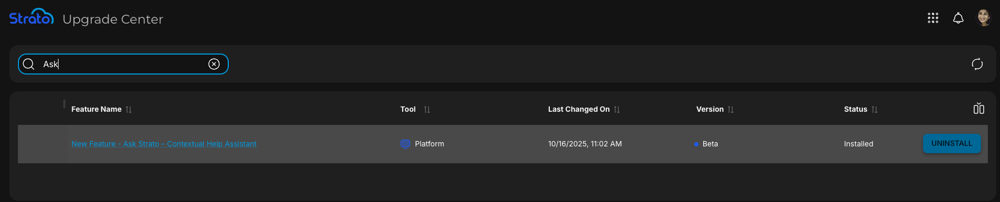
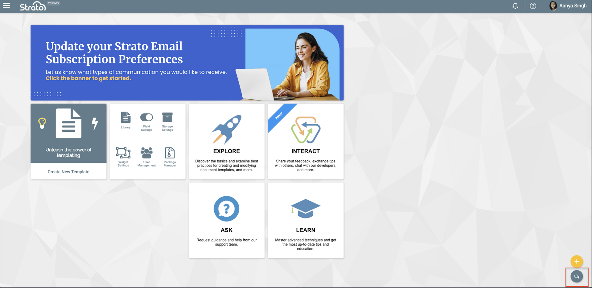
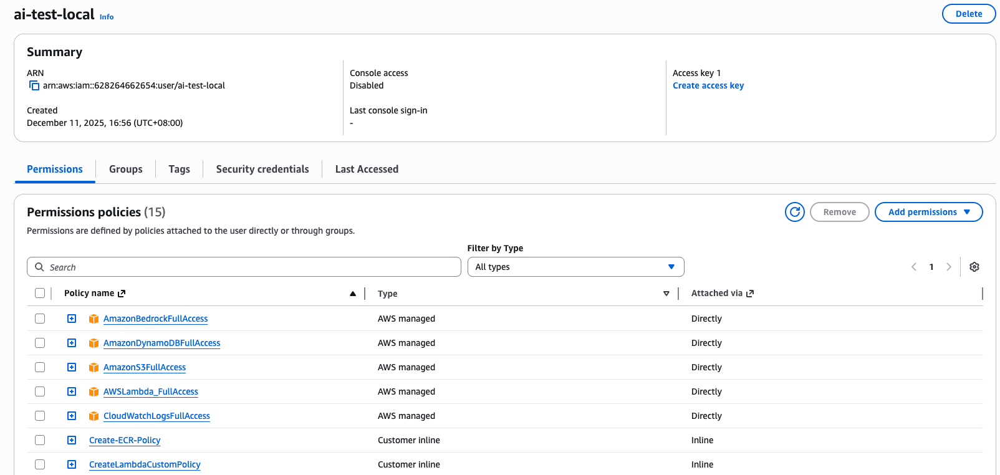

# Ask Strato AI Chatbot

An AI-powered chatbot that helps users find answers to product feature questions using AWS Bedrock and a Zendesk-powered knowledge base.

## Table of Contents

- [Overview](#overview)
- [Getting Started](#getting-started)
  - [Prerequisites](#prerequisites)
  - [Initial Setup](#initial-setup)
  - [AWS Configuration](#aws-configuration)
  - [Environment Variables](#environment-variables)
- [Project Structure](#project-structure)
- [Development Guide](#development-guide)
  - [Running Locally](#running-locally)
  - [Testing](#testing)
  - [Python Dependencies](#python-dependencies)
- [Architecture](#architecture)
  - [System Flow](#system-flow)
  - [Lambda Functions](#lambda-functions)
  - [Knowledge Base](#knowledge-base)
- [Feature Details](#feature-details)
- [Deployment](#deployment)

---

## Overview

### What It Does

Ask Strato is an AI chatbot that provides:

- Product feature-related question answering
- Real-time syncing with Zendesk articles
- Contextual responses with source references
- Conversation history and follow-up support
- Question filtering for Strato-related queries only

### Business Value

- **Saves Time**: No manual navigation through Zendesk documentation
- **Improves Efficiency**: Faster understanding of product features
- **Maintains Control**: Information-only responses, no automated actions
- **Shared Knowledge**: Integrated with Easy Suite products for future expansion

### How Users Access It

1. Enable via Upgrade Center in Strato v1
2. Search for "Ask Strato" feature and install

3. Chatbot appears at the bottom of the screen


---

## Getting Started

### Prerequisites

- Python 3.x installed
- AWS CLI installed
- Access to Strato Sandbox Account
- Homebrew (for macOS)

### Initial Setup

1. Clone the repository and navigate to the project directory

2. Create and activate a virtual environment:

```bash
# Create virtual environment
python3 -m venv .venv

# Activate virtual environment
source .venv/bin/activate

# Install dependencies
pip install -r requirements.txt
```

### AWS Configuration

#### Install AWS CLI

```bash
brew install awscli
```

#### Configure AWS Credentials

```bash
aws configure
```

You'll be prompted for:
- AWS Access Key ID
- AWS Secret Access Key
- Default region name: `us-west-2`

#### Creating IAM User (First Time Setup)
   
1. Open AWS Console → IAM → Users
2. Click "Create User"
3. Attach required policies (minimum):
   
   - AmazonBedrockFullAccess
   - AmazonS3ReadOnlyAccess
   - AmazonDynamoDBFullAccess
   - (Add others as needed by the application)
4. Create access key for the user

5. Save the Access Key ID and Secret Access Key
6. Use these credentials in `aws configure`

---

## Environment Variables

Environment variables are stored in `.env` files within each lambda function's local directory.

### 1. `local/chat/.env` - Main Chat Function

```bash
# AWS Parameter Store values
AICORE_KB_ID="/ore-cor-spn-dev/ai-ask-me/input/aiCoreKbId"

# Local values
AICORE_CHAT_HISTORY_TABLE=<DynamoDB table name for chat history>
AICORE_S3_BUCKET=<S3 bucket for Zendesk articles>
```

### 2. `local/get_products/.env` - Product Listing

```bash
AICORE_S3_BUCKET=<S3 bucket for Zendesk articles>
```

### 3. `local/receive/.env` - Webhook Receiver

```bash
WEBHOOK_SECRET=<Zendesk webhook secret>
EVENT_BUS_ARN=<EventBridge ARN>
```

### 4. `local/reporter/.env` - Chat Reporter (POC)

```bash
AICORE_CHAT_HISTORY_TABLE=<DynamoDB table for chat history>
```

### 5. `local/retrieve/.env` - Knowledge Base Retrieval

```bash
# AWS Parameter Store
AICORE_KB_ID=<Knowledge Base ID>

# Local values
AICORE_CHAT_HISTORY_TABLE=<DynamoDB table name>
AICORE_S3_BUCKET=<S3 bucket for articles>
```

### 6. `local/sync/.env` - Article Sync

```bash
# AWS Parameter Store
ZENDESK_BEARER_TOKEN=<Zendesk API token>
AICORE_KB_ID=<Knowledge Base ID>
AICORE_KB_DATA_SOURCE_ID=<Data Source ID>

# Local values
AICORE_S3_BUCKET=<S3 bucket for articles>
```

---

## Project Structure

```
.
├── cdk/                    # Infrastructure as Code (CDK scripts)
├── lambdas/               # Lambda function source code
│   ├── chat/             # Main chatbot logic
│   ├── get_products/     # Product listing endpoint
│   ├── receive/          # Zendesk webhook receiver
│   ├── reporter/         # Chat analytics (POC)
│   ├── retrieve/         # Knowledge base retrieval
│   └── sync/             # Article synchronization
├── layers/               # Lambda layers (Python packages)
│   ├── python_markdown_layer/
│   └── sto-sync-zendesk-articles-layer/
├── local/                # Local development versions
│   ├── chat/
│   ├── frontend/         # Test UI
│   ├── get_products/
│   ├── receive/
│   ├── reporter/
│   ├── retrieve/
│   └── sync/
├── tests/                # Unit tests (pytest)
├── requirements.txt      # Python dependencies
└── README.md            # This file
```

---

## Development Guide

### Running Locally

#### Lambda Functions with Flask

For functions with `app.py`:

```bash
cd local/<function-name>
flask run --reload
```

The `--reload` flag enables auto-reload on file changes.

#### Lambda Functions without Flask

```bash
cd local/<function-name>
python <filename>.py
```

#### Testing the Chatbot Locally

1. **Start Backend**:
   ```bash
   cd local/chat
   flask run --reload
   ```

2. **Open Frontend**:
   - Navigate to `local/frontend/`
   - Open `local-index.html` in your browser

### Testing

Run unit tests from the project root:

```bash
cd tests
pytest -vv
```

Options:
- `pytest` - Run all tests
- `-v` - Verbose output
- `-vv` - Very verbose output

### Python Dependencies

| Library | Purpose |
|---------|---------|
| `boto3` | AWS SDK for Python (Bedrock, S3, DynamoDB) |
| `python-dotenv` | Load environment variables from `.env` files |
| `Flask` | Local development server |
| `Flask-Cors` | Enable CORS for local testing |
| `html2text` | Convert HTML to plain text |
| `requests` | HTTP client for API calls |
| `pytest` | Testing framework |
| `Markdown` | Convert Markdown to HTML |
| `watchdog` | File system monitoring for Flask reload |

#### Important Notes

- Only add libraries to Lambda Layers if they're used in production
- Don't add `boto3` to Lambda Layers (AWS Lambda includes it by default)
- Development-only libraries should stay in `requirements.txt`

---

## Architecture


### System Flow

```
User Question → Lambda (Chat) → Bedrock AI → Knowledge Base → Response
                    ↓
              DynamoDB (Session History)
```

### Lambda Functions

| Function | Purpose | Trigger |
|----------|---------|---------|
| `chat` | Main chatbot logic | API Gateway |
| `get_products` | List available products | API Gateway |
| `receive` | Receive Zendesk webhooks | API Gateway |
| `retrieve` | Fetch KB chunks (Easy Suite) | API Gateway |
| `reporter` | Analytics on chat history | API Gateway |
| `sync` | Sync Zendesk articles to KB | EventBridge |

### Knowledge Base

The Knowledge Base is an OpenSearch Vector Database that:

- Stores Zendesk articles as vector embeddings
- Groups semantically similar content
- Enables fast semantic search for relevant articles

#### Metadata Schema

| Field | Description | Embedded | Filterable |
|-------|-------------|----------|------------|
| `category_id` | Zendesk category ID | ❌ | ✅ |
| `category_name` | Product name | ✅ | ✅ |
| `section_id` | Parent article ID | ❌ | ✅ |
| `section_name` | Parent article name | ✅ | ✅ |
| `article_id` | Current article ID | ❌ | ✅ |
| `article_name` | Current article name | ✅ | ✅ |
| `url` | Zendesk URL | ✅ | ✅ |
| `created_date` | First published date | ✅ | ❌ |
| `updated_date` | Last updated date | ✅ | ❌ |

### Article Syncing Process

1. **Zendesk Webhook** triggers on article publish/unpublish
2. **Receive Lambda** validates and forwards event
3. **Sync Lambda** processes the event:
   - **Published**: Downloads article → Converts to text → Uploads to S3 → Syncs to KB
   - **Unpublished**: Removes from S3 → Syncs KB (removes entry)

### Conversation Context

When a user asks a question, the system includes:

1. **User Input**: The actual question
2. **Tool Context**: Current location in Strato (e.g., "Document Template Editor")
3. **Session History**: Previous questions and answers from the same session
4. **Product Context**: Which product the user is working with

---

## Feature Details

### Conversation History

- Stored in DynamoDB with session IDs
- Maintains context across multiple questions
- Enables follow-up questions without repeating context

### Question Filtering

- Blocks non-Strato-related questions
- Ensures responses stay within product scope
- Improves response accuracy

### Context Awareness

- Detects user's current tool/location in Strato
- Provides more relevant answers based on context
- Reduces ambiguity in responses

---

## Lambda Handler Pattern

All Lambda functions follow this pattern:

```python
def lambda_handler(event, context):
    try:
        # Parse request body and headers
        body = event['body'] if isinstance(event.get('body'), dict) else json.loads(event['body'])
        headers = event['headers'] if isinstance(event['headers'], dict) else json.loads(event['headers'])
        
        # Business logic here
        # ...
        
        return {
            "statusCode": 200,
            "body": json.dumps(response_data),
            "headers": {
                "Content-Type": "application/json",
                "Access-Control-Allow-Origin": "*"
            }
        }
    except Exception as e:
        LOGGER.exception(f"Error: {e}")
        return {
            "statusCode": 500,
            "body": json.dumps(f"Error: {str(e)}"),
            "headers": {
                "Content-Type": "application/json",
                "Access-Control-Allow-Origin": "*"
            }
        }
```

### Request/Response Structure

- **Payload**: Contained in `event['body']`
- **Headers**: Contained in `event['headers']`
- **Response**: Dictionary with `statusCode`, `body`, and `headers`

---

## Deployment

Deployment is managed through AWS CDK scripts in the `cdk/` directory.

```bash
cd cdk
npm install
cdk deploy
```

---

## Additional Resources

- [AWS Bedrock Documentation](https://docs.aws.amazon.com/bedrock/)
- [Internal AWS Setup Guide](https://stratohcm.odoo.com/odoo/knowledge/749)
- [Ask Strato AI Chatbot - Internal Documentation](https://stratohcm.odoo.com/odoo/knowledge/305)
- Zendesk API Documentation (contact IT for access)

---

